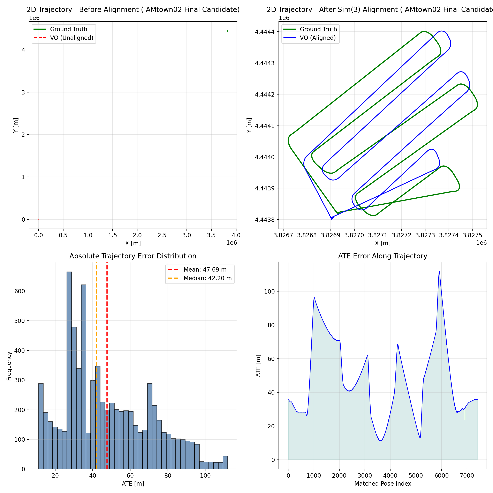
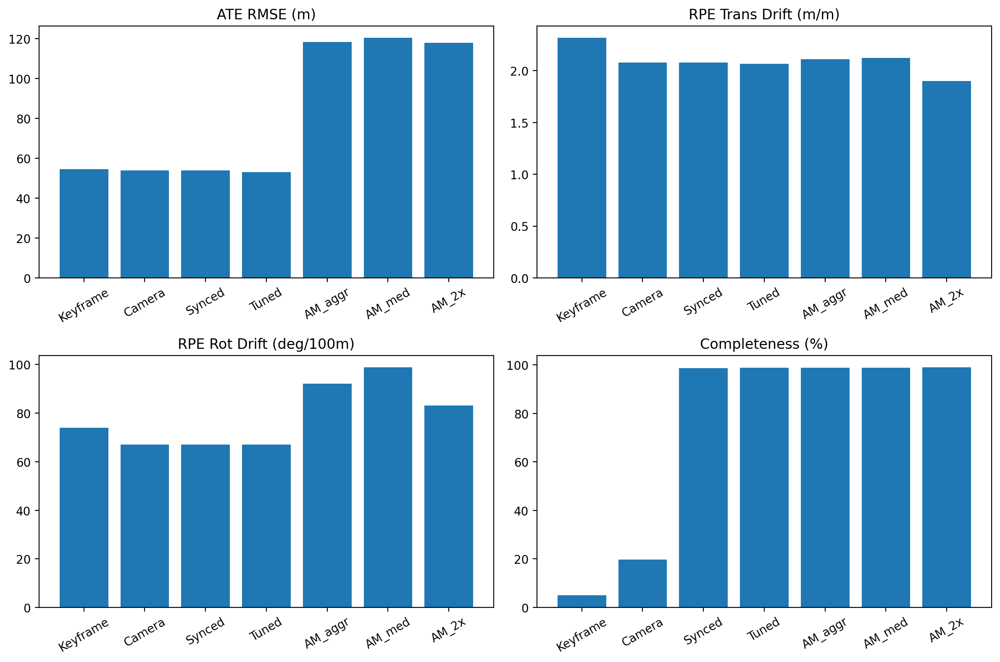

# Visual Odometry Module (ORB-SLAM3)

This folder contains the **Visual Odometry (VO)** part of our AAE5303 group project.

---

## 1. Task Overview

This module focuses on **monocular ORB-SLAM3** on the **AMtown02** UAV sequence.

The goal is to:

- run a reproducible monocular VO pipeline,
- tune camera / ORB-related parameters,
- export the estimated trajectory,
- evaluate it against synchronized ground truth,
- report the final result clearly.

---

## 2. Team Role

- **Evelyn4k4k** — Visual Odometry
- **wymmust** — 3D Reconstruction
- **taiwanhaitong-crypto** — Semantic Segmentation

---

## 3. Dataset

- **Sequence:** `AMtown02`
- **Source family:** MARS-LVIG / UAVScenes
- **Input modality:** monocular RGB images
- **Final evaluation target:** synchronized full-frame `CameraTrajectory`

---

## 4. Method

We use **ORB-SLAM3** as the backend for monocular visual odometry.

### Pipeline

1. Extract images from the selected sequence  
2. Extract and synchronize ground truth to image timestamps  
3. Run monocular ORB-SLAM3 with tuned camera settings  
4. Export:
   - `CameraTrajectory.txt`
   - `KeyFrameTrajectory.txt`
5. Evaluate the trajectory
6. Generate final figures and summary metrics

---

## 5. Final Submitted Configuration

The final selected setting is:

- **Official AMtown calibration**
- **Original image resolution**
- **Medium ORB tuning**

Final config file:

```text
modules/vo/configs/camera_config_amtown02_medium.yaml
````

This configuration was selected because it achieved the **best overall balance** among all tested settings.

### Final Result

* **ATE RMSE:** 52.988 m
* **RPE Trans Drift:** 2.067 m/m
* **RPE Rot Drift:** 67.079 deg/100m
* **Completeness:** 98.79%

---

## 6. Experimental Comparison

| Version | Configuration                                                   | ATE RMSE (m) | RPE Trans Drift (m/m) | RPE Rot Drift (deg/100m) | Completeness (%) | Notes                                                               |
| ------- | --------------------------------------------------------------- | -----------: | --------------------: | -----------------------: | ---------------: | ------------------------------------------------------------------- |
| V1      | `KeyFrameTrajectory.txt` + original high-frequency GT           |       54.397 |                 2.316 |                   74.015 |             5.09 | Keyframe-only evaluation severely underestimated completeness.      |
| V2      | `CameraTrajectory.txt` + synchronized GT + old HK-style config  |       53.946 |                 2.077 |               **67.043** |            98.68 | First valid full-frame evaluation after fixing GT synchronization.  |
| V3      | Official **AMtown** calibration + medium tuning                 |   **52.988** |                 2.067 |                   67.079 |            98.79 | **Final selected result.** Best overall balance and lowest ATE.     |
| V4      | Official **AMtown** calibration + aggressive tuning             |      118.237 |                 2.111 |                   92.059 |            98.76 | Aggressive feature tuning degraded global trajectory accuracy.      |
| V5      | Official **AMtown** calibration + 2× downsample + medium tuning |      117.771 |             **1.899** |                   83.185 |        **98.93** | Slightly lower translational drift, but much worse global accuracy. |

---

## 7. Key Findings

* **`CameraTrajectory.txt` is more suitable than `KeyFrameTrajectory.txt`** for final reporting because it provides full-frame trajectory coverage.
* **Ground-truth synchronization is necessary**; otherwise completeness becomes misleading.
* **Medium tuning produced the best overall result** on AMtown02.
* **Aggressive tuning and 2× downsampling were not good final choices** for this sequence.

---

## 8. Reproducibility

### Prepare data

```bash
python3 modules/vo/scripts/data_prep/extract_images_amtown02.py
python3 modules/vo/scripts/data_prep/extract_groundtruth_amtown02.py
python3 modules/vo/scripts/data_prep/sync_groundtruth_to_images.py
```

Optional downsampling experiment:

```bash
python3 modules/vo/scripts/data_prep/downsample_images_2x.py
```

### Run ORB-SLAM3

Example command:

```bash
cd ~/projects/ORB_SLAM3
./Examples/Monocular/mono_tum \
  Vocabulary/ORBvoc.txt \
  /path/to/modules/vo/configs/camera_config_amtown02_medium.yaml \
  /path/to/extracted_images
```

### Save final trajectories

Archive the final outputs as:

* `CameraTrajectory.txt` → `modules/vo/final_candidate/CameraTrajectory_best.txt`
* `KeyFrameTrajectory.txt` → `modules/vo/final_candidate/KeyFrameTrajectory_best.txt`

### Evaluate trajectory

Example:

```bash
python3 modules/vo/scripts/evaluation/evaluate_vo_accuracy.py \
  --groundtruth data/ground_truth/ground_truth_synced.txt \
  --estimated modules/vo/final_candidate/CameraTrajectory_best.txt \
  --t-max-diff 0.1 \
  --delta-m 10 \
  --workdir modules/vo/final_candidate/figures \
  --json-out modules/vo/final_candidate/metrics_best.json
```

### Final report files

The final selected result is summarized in:

```text
modules/vo/final_candidate/metrics_best.json
modules/vo/final_candidate/ChatGPT_spokesperson_leaderboard.json
modules/vo/output/evaluation_report.json
```

---

## 9. Folder Structure

```text
modules/vo/
├── configs/
│   ├── camera_config_amtown02_medium.yaml
│   ├── camera_config_amtown02_aggressive.yaml
│   ├── camera_config_amtown02_medium_2x.yaml
│   └── camera_config_amtown02_tuned.yaml
├── figures/
│   └── trajectory_evaluation...
├── final_candidate/
│   ├── figures/
│   │   ├── ate.zip
│   │   ├── best_result_summary.png
│   │   ├── metrics_comparison.png
│   │   ├── sample_images.png
│   │   └── trajectory_evaluation_best.png
│   ├── recheck_best/
│   │   ├── ate.zip
│   │   ├── rpe_rot.zip
│   │   └── rpe_trans.zip
│   ├── CameraTrajectory_best.txt
│   ├── ChatGPT_spokesperson_leaderboard.json
│   ├── KeyFrameTrajectory_best.txt
│   └── metrics_best.json
├── output/
│   └── evaluation_report.json
├── scripts/
│   ├── data_prep/
│   ├── evaluation/
│   └── inspection/
└── README.md
```

---

## 10. Final Artifacts

### Final trajectory evaluation



### Metrics comparison



### Sample images


### Final result summary


---

## 11. Repository Inspection

Required collaborators for inspection:

* `Qian9921`
* `qmohsu`

---

## 12. Notes

* `camera_config_amtown02_medium.yaml` is the **final selected configuration** used for the best V3 result.
* `camera_config_amtown02_tuned.yaml` is an intermediate tuned baseline.
* `camera_config_amtown02_aggressive.yaml` and `camera_config_amtown02_medium_2x.yaml` are comparison experiment settings.
* The final submission result is based on the **V3 medium-tuning configuration**, not on the older HK-style config.

---

## 13. Acknowledgements

* Course: **AAE5303 Robust Control Technology in Low-Altitude Aerial Vehicle**
* Instructor: **Dr Li-Ta Hsu**
* Baseline system: **ORB-SLAM3**
